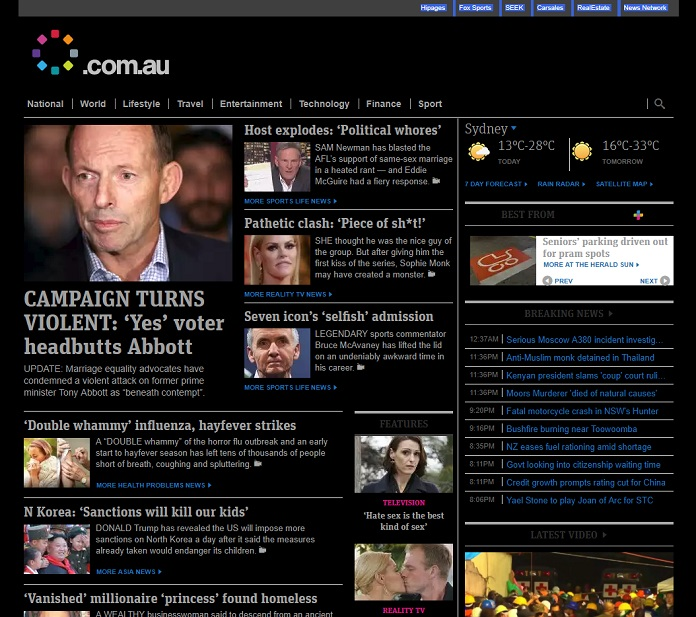

# news.com.au dark

- Dark theme for [news.com.au](https://www.news.com.au)

## Install
- Download a userstyle manager (eg. [Stylus](https://add0n.com/stylus.html))
- Visit the [news.com.au dark page on userstyles.org](https://userstyles.org/styles/148468/news-com-au-dark)
- Click 'Install Style'